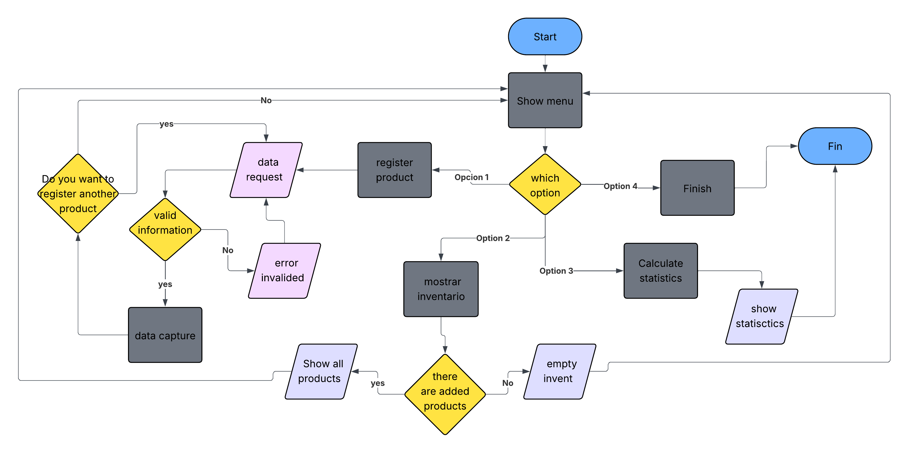

# 📦 Inventory-modular

## 📄 Project Description
A program that lets you manage a product inventory in an interactive way. You can add products by entering the name, price, and quantity. The system validates the data, calculates inventory statistics, and displays the results on screen. Everything works through a menu that stays active until the user decides to exit.

## ⚙️ How it works
1. Displays a main menu with 4 options
2. Option 1: asks if you want to register a product, then requests name, price, and quantity with data validation
3. Option 2: displays all registered products with their price and quantity
4. Option 3: calculates and displays total inventory value, total units, and total distinct products
5. Option 4: exits the program

---

## 🛠️ Technologies used
- Python 3

---

## ▶️ How to run the code
1. Make sure you have Python installed
2. Download all the files:
   - `main.py`
   - `inventory.py`
   - `add_product.py`
   - `show_inventory.py`
   - `statistics.py`
   - `menu.py`
3. Open the terminal and run:
---

## 🔀 Flowchart

---

## ✍️ Author
Breyner - 2026
